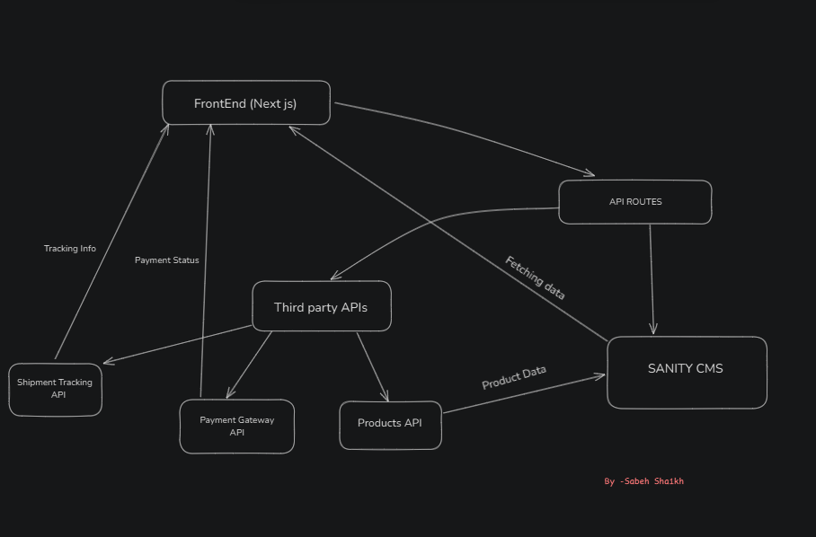
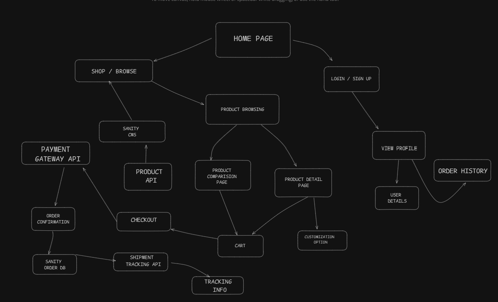
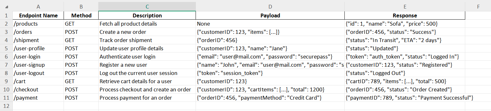

# Marketplace Technical Foundation - Furniro

## 1. System Architecture Overview

### Front-End:
- **Responsive design** to ensure compatibility with mobile, tablet, and desktop screens.
- Developed using **modern web technologies**.
- **User-friendly interface** across all pages.

### Essential Pages:
1. **Home Page**: Central hub showcasing featured furniture, new arrivals, etc.
2. **Shop**: Displays all available furniture categories.
3. **Single Product Page**: Detailed view of individual furniture pieces, including descriptions, sizes, and customization options.
4. **Cart**: User-friendly cart page to review items, adjust quantities.
5. **Checkout**: A secure checkout process for reviewing the order and completing payment.
6. **Login/Signup**: User authentication pages for customers to register and manage their accounts.
7. **Contact Page**: Form for customers to get in touch with inquiries, support, or feedback.
8. **Blog**: A section for blog posts related to furniture trends.
9. **Profile Page**: A personalized dashboard for customers.
10. **Product Comparison**: Enables customers to compare different furniture pieces.
11. **Order Tracking**: Allows customers to track the status of their orders and view shipment updates.

### Sanity CMS:
Using **Sanity CMS** to manage product data, customer details, and order records. Sanity acts as the database for our marketplace.

Sanity CMS will be used for managing:
- **Products**: Categories, prices, stocks, and customizations.
- **Blogs**: Title, content, images, and tags for articles.
- **Customer Information**: Storing user details, saved addresses, and order history.
- **Orders**: Providing real-time updates on order status.

### Third-Party API Integrations:
Integrate APIs for shipment tracking, payment gateways, and other required backend services.

APIs will be used for:
- **Payment Solutions**: Secure gateways for processing transactions.
- **Logistics**: Integration with delivery partners for efficient shipping and tracking.
- **Authentication**: Secure sign-in/sign-up methods.
- **Tracking**: Real-time order and delivery tracking systems.

## 2. System Architecture Diagram

## 3. Workflow Diagram

## 4. API Endpoints

